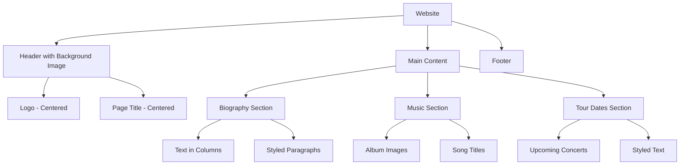

# Pop Singer Website Plan

## Project Structure
```
W2L1/
├── index.html
└── styles.css
```

## Website Structure


## CSS Features to Implement

### Text Styling
1. Column layout for biography text
2. Line spacing adjustments
3. Letter kerning for headings
4. Justified text with and without hyphens
5. First line styling

### Background Images
1. Header background image
2. Background image options (repeat, position, size)
3. Overlay effects for text readability

### Centering Techniques
1. Horizontal centering of elements
2. Vertical centering of elements
3. Combined horizontal and vertical centering

## Implementation Steps

1. Create basic HTML structure
2. Add CSS file with modern styling
3. Implement text formatting features
4. Add background images with styling options
5. Center elements using different techniques
6. Test across different browsers